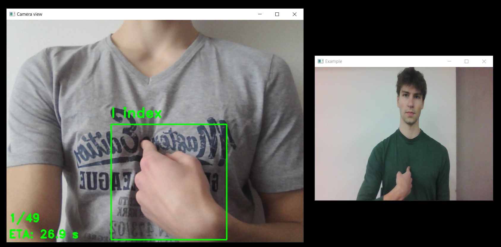
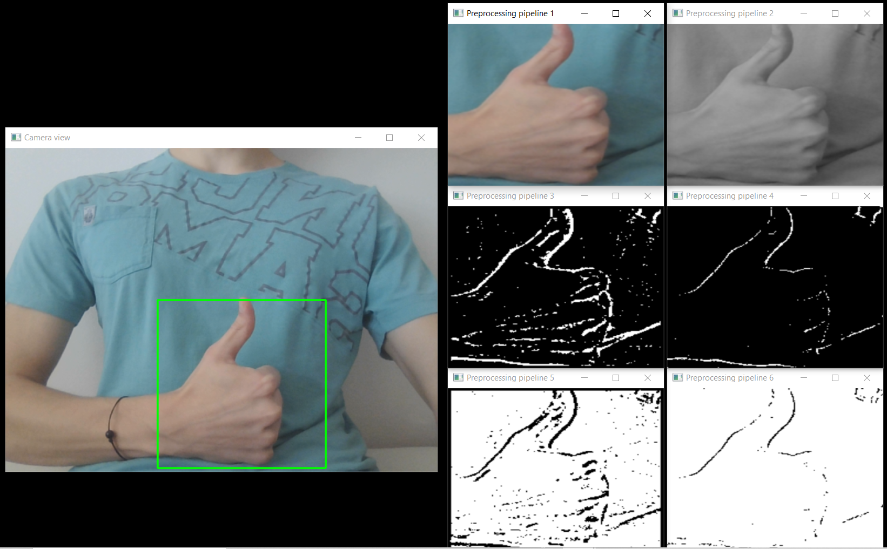

# Recognition of the American Sign Language in real time

## Description
This project is a real-time American Sign Language (ASL) recognition system built using mainly TensorFlow, Keras, OpenCV2 and Python. It features multiple scripts for tasks ranging from data collection over model building and training to real-time model prediction from camera. The project was built as a fundamental component of the bachelor's thesis of mine, with the topic of "Construction of a Neural Networks model for translation of recorded sign language".

The repository also features a LeNet-based model pre-trained on a dataset collected by myself that features around 2,000 samples per each of 49 unique categories. The dataset comprises hands of 10 different people aged 10-64 of both genders that used both their hands while signing the gestures in front of almost 50 unique backgrounds under various lighting conditions. This helped the model achieve substantial ability to generalize to previously unseen data and reach real-time accuracy of 100 % for easier backgrounds with any lighting conditions and 93 % for extremely hard backgrounds with very poor lighting conditions.

## Table of Contents

- [Description](#description)
- [Features](#features)
- [Demonstration](#demonstration)
- [Installation](#installation)
- [Components and Project Structure](#components-and-project-structure)
- [Usage](#usage)
  - [Image Collection](#image-collection)
  - [Preprocessing Pipelines Comparison](#preprocessing-pipelines-comparison)
  - [Model Training](#model-training)
  - [Real-time Model Prediction](#real-time-model-prediction)
- [Model building](#model-building)
  - [Preprocessing Pipelines](#preprocessing-pipelines)
  - [Trainable Model](#trainable-model)
- [Common Issues and How to Fix Them](#common-issues-and-how-to-fix-them)
  - [ImportError: cannot import name 'builder' from 'google.protobuf.internal'](#importerror-cannot-import-name-builder-from-googleprotobufinternal)

## Features

* Live camera environment with handmade examples illustrating gestures in the dataset
* Image collection environment for navigating the user through the data collection process
* Demonstration and comparison of various preprocessing pipelines in real time
* Convenient model and preprocessing pipeline building with textual instructions for architectures
* Model training with user friendly hyperparameter specification
* Model deployment for real-time prediction with the device's camera
* Model prediction voicing

## Demonstration

This video features a short demonstration of real-time predictions for the model:

!!!!

**TODO**

!!!!

## Installation

This section shall guide the full installation process. Presence of Python v3.10.9 and pip package installer on the device and basic knowledge of Python is assumed in this section and generally throughout this whole repository.

The first step is to clone this repository, fork it or download ZIP version of the code. As the next step, setting up a virtual environment for Python is strongly recommended. All the necessary packages can then be installed from the requirements.txt file, which is a part of the repository. Another way is to set up a virtual environment with all the requirements via Conda (package manager). These steps can look along the following lines:

```
# To create a virtual environment with all required packages via conda:
conda env create -f requirements.yml

# To install all packages specified in the requirements.txt file via pip:
pip install -r requirements.txt
```

## Components and Project Structure

Firstly, a slight disclaimer - please make sure to preserve the layout of the project as it is, since changing the folders, filenames or location of the files may lead to unexpected behaviour. Also note that the main parts of this script will only work on a device with a working camera and the scripts utilizing image capturing might need slight tweaking in case the camera cannot be found in the default spot by `opencv2`.

As it currently stands, the root directory of this project contains 6 folders and numerous files. This section shall provide a brief summary for most of these with further breakdown for the most important functionalities being presented in the following [Usage](#usage) section.

* `pretrained_log` provides a TensorBoard log directory for the pre-trained model.
* `Data` folder contains a small sample dataset, which is insufficient for satisfactory live recognition from camera but is enough for presentation of the training process.
* `Examples` folder stores the example images for each of the gestures in the dataset. These instruct the users on how to perform each individual sign.
* `preprocessing_pipelines` is the folder to store images of various preprocessing pipelines for comparison. This is where images from `showcase_collect_preprocessing.py` are saved.
* `model` stores the scripts regarding model training as well as the models themselves.
  * `model/current` folder is where the current pre-trained model is saved.
  * `model/experiments` folder is created to store subsequent model training runs when starting training for the first time (not originally present in this repository).
  * `model/knn_summary.txt` and `model/rfc_summary.txt` provide evaluations of the classical ML models used in this research for comparison (k-Nearest Neighbours and Random Forest).
  * `model/model.py` is a script for building the model and preprocessing pipeline based on given text instructions.
  * `model/preprocessing.py` is a script containing auxiliary classes and functions, such as custom TensorFlow layers and callbacks.
* `collect_dataset.py` is a script that takes the user through the image collection process.
* `config.json` is a configuration file for this project. Some important settings can be specified in this file, including paths to some components or the image size for the dataset.
* `gestures.txt` is a list of gestures that are used in this project.
* `run.py` is the run script for this project. Through this script, the usery can access every other component of the project by specifying the procedure in the command line.
* `showcase_collect_preprocessing.py` is a script for real-time demonstration, comparison and saving of various preprocessing pipelines.
* `showcase_model` is a script that starts the real-time environment and utilizes the model for real-time prediction if prompted to do so.
* `translations.txt` is a file with English-Czech gesture pairs to enable using the application in both languages.
* `utils.py` is a script storing various utility functions, such as functions for project initialization etc.

## Usage

This section will cover the guidelines to using all components of this project as well as all features assigned to them. From perspective of the user, every component can be accessed via the run script stored in the root directory of this project:

```
python run.py
```

From the most superficial perspective, the run script provides 5 different options:
1. `python run.py -col` or `python run.py --collect` - this starts the image collection process.
2. `python run.py -show` or `python run.py --showcase` - this is a basic procedure that can be used to familiarize the user with the environment and its controls. It starts the real-time camera view as well as shows the Example images. The user can use the same controls as with other components (see section [Real-time Model Prediction](#real-time-model-prediction) below). No images are saved and no predictions are done during this procedure. This is also the default procedure that is run when only `python run.py` is given.
3. `python run.py -prep` or `python run.py --preprocessing` - this starts the process for comparison of various preprocessing pipelines in real-time.
4. `python run.py -tr` or `python run.py --train` - this command starts the training procedure.
5. `python run.py -pred` or `python run.py --predict` - when this command is entered, the run script tries to find a pre-trained model and use it for real-time prediction.

Some of these procedures as well as their individual settings or parameters can then be further specified by additional commands. These can be found in the respective sections below. For every process, the location of the configuration file (`config.json`) can also be specified by inserting `--config_dir=path`, where path is relative with respect to the `run.py` script. Nevertheless, the users are advised to keep the layout of the project unchanged, therefore the default `--config_dir=""` would suffice and the user does not have to set it manually.

### Image Collection

The image collection scripts starts with initializing a real-time camera view as well as a window with example gestures from the `Example` folder serving as templates for the user. The images are saved into the `Data` folder.

In the `config.json` file, the user can specify the image collection process beforehand. Apart from specifying the paths to the `translations.txt` and `gestures.txt` files, the user can set the *Image size* for the saved images (please note that the pre-trained model has been trained with image size 196, thus changing this parameter would require creating a new model for real-time inference purposes) as well as what is the *Desired amount*, that should be present in the `Data` folder per gesture at the end of the image collection procedure. For cases when the `Data` folder already contains this many files for each of the gestures, the user is prompted to confirm, whether they want to increase this amount by the *Top-up amount* (which results in collectiong Top-up amount-many images per gesture).

The real-time camera view contains a rectangle which signalizes what part of the frame is being saved as well as name of the gesture that is currently being collected, the progress in terms of the number of the current gesture and the estimated time until the next gesture (ETA) in seconds. Every time a new gesture is being collected, a larger frame with the example photo is displayed for the user to get familiar with the gesture. Then, there is a slight warm-up period, during which the images are not being saved - this is signalized by the colours of the frame and texts being red. When these turn green, the images are being saved until the desired amount of frames per gesture are obtained or until the user decides to skip to the next gesture.

To navigate the image collection process, the user has multiple controls (note that on most devices, the user must first select the live view in order for these to work):
* Pressing `Spacebar` moves the rectangle into another position (there are 3 in total - starting with lower mid, then moving to upper left and then upper right).
* `q` key can be used to end the process for the current gesture and skip to the next one.
* `l` key switches the language of the gestures.
* `p` pauses the process (and then `p` starts it again).
* `Esc` key can be used to terminate the whole process.



### Preprocessing Pipelines Comparison

Running the script for preprocessing demonstration starts the classical real-time camera view but also opens 6 other smaller windows. Each of these displays a different preprocessing pipeline working in real time. These pipelines are specified in the `config.json` file in the form of textual instructions for the `build_preprocessing` function - for guidelines on these, please refer to the [Model Building](#model-building) section.

This script offers controls in form of the `Esc` and `Spacebar` keys same as the image collection script. Furthemore, the `q` key can be used to save the current layout - in the `preprocessing_pipelines` folder, a new folder is created. This folder stores the summaries of the currently compared preprocessing pipelines and then with each press of the `q` key, a folder that contains an image for each of these.



### Model Training

The script for model training gathers the parameters specified by the user in the command line and starts model training. The user might be prompted to confirm some folder management, since training experiments are saved either into the `model/current` or `model/experiments` directory, where each experiment has its own numbered folder. This folder is then used for checkpoint saving as well as for saving the whole model after finishing the process. During training, multiple metrics are calculated and displayed - loss, accuracy, precision, recall, AUC and F1-score (all of these both training and validation). The training script also automatically checks the number of available GPUs, distributes the training across these in case more are available and also performs few precautions for this case (e.g., batch size increase). The training process also utilizes all available CPUs.

The following arguments can be passed to the training script for further specification of the process:
* `--experiment=N` (default None) - by inputing an integer *N*, this sets the numbering for the folder in `model/experiments`, i.e. `experiment_N`. If not given, the user will be prompted to confirm creation of new folder, which will be numbered as the number of experiment folders + 1. The user can also give `--experiment=-1`, which changes the save location for this experiment to `model/current`. In case the `model/current` folder already exists, the user is warned about the dangers of overwriting some previously saved model.
* `-tb` or `--tensorboard` - including this argument turns on the TensorBoard callback, which results in saving the TensorBoard logs into the `logs` directory (by default, can be adjusted in the configuration file). After finishing the training procedure, the user can then open up the TensorBoard by running the following command from the root directory: `tensorboard --logdir=logs` (or a different folder, for instance with the given pre-trained, this could be `tensorboard --logdir=pretrained_log`. Apart from training performance evolution, TensorBoard also saves the evolution of learning rate (if it is changing) and confusion matrices after every epoch. Note that using TensorBoard during training may slow the training down.
* `-es=monitor` or `--early_stopping=monitor`, where *monitor* is one of *\["disable", "loss", "accuracy", "f1_score", "recall", "precision", "auc"\]* (default loss) - using this argument with the *monitor* parameter other than "disable" sets up the Early Stopping callback, which stops the training process after 5 epochs of no improvement (where improvement delta is set to 0.001) in the given metric to monitor (or if after 10 epochs, the metric is not under the baseline of 1.5 for loss or over the baseline of 1.5 for other metrics).
* `-nockpt` or `--disable_checkpoint` - entering this argument omits saving the training checkpoints after every epoch (the model is still saved after the full training).
* `--seed=N` (default 123) - this sets the seed for TensorFlow random operations to *N*.
* `--split=f` (default 0.3) - this sets the ratio of the train-test split to (1-*f*):*f*.

Furthermore, the training process can be specified by the following hyperparameter options:
* `-bs=N` or `--batch_size=N` (default 128) - a positive integer that sets the batch size to *N*.
* `-e=N` or `--epochs=N` (default 10) - a positive integer to set the number of epochs to *N*.
* `-opt=S` or `--optimizer=S` (default "adam") - the optimizer *S* to use with its corresponding weight decay variant (if expected). One of "adam" or "SGD".
* `-lr=f` or `--learning_rate=f` (default 0.01) - a positive float *f* that specifies the initial learning rate.
* `-lrd=N,M,O` or `--lr_decay=M,N,O` (default None) - a list of positive integers separated by commas (e.g., 10,20,30). The learning rate is reduced by a factor of 10 after each of these epochs (i.e., after *M*, *N* and *O* epochs).
* `-lrw` or `--lr_warmup` - if given, learning rate warm-up is applied (gradual (per batch) linear learning rate scaling throughout the first five epochs starting from zero).
* `-mom=f` or `--momentum=f` (default 0) - a positive float *f* to specify the momentum for the SGD optimizer.
* `-wd` or `--weight_decay` (default 0) - a positive float *f* specifying strength of the weight decay within the optimizer.
* `-ls=f` or `--label_smoothing=f` (default 0) - a positive float between 0 and 1 that prompts the script to apply label smoothing with strength *f* within the categorical crossentropy loss.

Last but not least, the training procedure offers the following ways to further specify the process:
* `-raug=M,N` or `--randaugment=M,N` (default None) - if given, the RandAugment augmentation pipeline with strength *M/100* (where *M* is a positive integer) and *N* augmentations per sample (where *N* is a positive integer) will be applied to the training set. Note that this significantly slows down the training process.
* `-arch=S` or `--architecture=S` (default None) - this sets the architecture of the trainable model to *S*. For more information on how to set these instructions, please refer to the [Model building](#model-building) section. If this argument is not specified, the default architecture from the `config.json` file is taken.
* `-prep=S` or `--preprocessing_layers=S` (default None) - this sets the architecture of the preprocessing pipeline to *S*. For more information on how to set these instructions, please refer to the [Model building](#model-building) section. If this argument is not specified, the default architecture from the `config.json` file is taken.

These arguments offer very convenient way of completely specifying the training procedure and architecture simply from the command line. It is also worth noting, that these arguments are then saved to a .txt file together with the model summaries and performance results in the respective experiment folder, so that the experiments can be tracked easily. The following line shows an example usage of the training process:

`python run.py -tr -tb -prep_layers="I,G,T-tm-b7-c(3),R" -arch="I,C-k5-f128-s1,P-tm-p3-s4,C-k5-f256-s1,P-tm-p3-s4,H-256,B,H-512,O" -nockpt -es=disable -raug=10,3 --epochs=50 -lrd=34,45 -opt=SGD -mom=0.95 -lr=0.01 -wd=0.003 -bs=32`

This training procedure utilizes TensorBoard, sets the architectures of the preprocessing and trainable layers and disables checkpointing and Early Stopping. Beforehand, RandAugment with strength 0.1 and 3 augmentations per sample is applied to the training dataset. It lasts for 50 epochs with learning rate decay applied after 34th and 45th epoch. The training is done with the SGD optimizer with momentum set to 0.95, initial learning rate of 0.01 and weight decay of 0.003. Batch size is 32. Note that the ordering of the arguments does not matter.

### Real-time Model Prediction

Lastly, real-time model inference can be started. The run script attempts to load the model saved in the location given by the "Current model" element of the `config.json` file (by default this is set to `model/current`. If successful, the model is then used for real-time inference. The layout is shown in the [Demonstration](#demonstration) chapter - the main window displays the camera view with the frame used for inference as well as the 3 most confident predictions with their probabilities and also the time taken per gesture in seconds (TPG). The secondary window then displays the example gestures for inspiration - during prediction, these are looped across infinitely.

The live prediction regime offers two further specifications:
* `--guided` - if given, the predictions are colour-coded with the correct one (which is considered to be the one in the current example photo) being green and the others red.
* `--voice` - if given, the prediction voicing is enabled.

This script offers similar controls to the other components:
* Pressing `Spacebar` moves the rectangle into another position (there are 3 in total - starting with lower mid, then moving to upper left and then upper right).
* `q` key can be used to move to the following example image. If prediction voicing is enabled, the most confident prediction of the model per frame is gathered and with hit of the `q` key, the most common prediction is vocalized (and the counts are set to 0).
* `l` key switches the language of the gestures.
* `p` pauses the process (and then `p` starts it again).
* `Esc` key can be used to terminate the whole process.

## Model Building

To enable convenient model building during training using textual instructions from the command line or from the configuration file, two model building functions were built (one for preprocessing, one for trainable layers). This chapter shall serve as guide for using these. Apart from the textual instruction, these functions also take a name for the model and input dimensionality as inputs. Furthemore, the function for the trainable model also supports specification of the output size to correctly choose the activation function for the output layer.

In general, the textual instruction for these functions is in the form "layer1_type-specification1-specification2-specificationN,layer2_type,layerN_type", so the user is enabled to chain various types of layers in a sequential manner while also further specifying some of their parameters. Layers are separated by commas while their specifications are separated by dashes. For both functions, the input layer (with the given input shape) is added automatically if not present in the instructions as the first layer.

### Preprocessing Pipelines

The function for building the preprocessing pipeline supports the following layers and their respective parameters and parameter values:
* `Input`: I
* `Grayscaling`: G
* `AdaptiveThresholding`: T
    * `type`: t (one of Gaussian (g) or mean (m))
    * `block_size`: b - default is 3
    * `constant`: (c) (given in parentheses) - default is 0
* `Rescaling`: R

Given these options, an example prompt could look as follows: "I,G,T-tm-b3-c(-3),R". This would build a preprocessing pipeline that consists of an input layer of given shape, a Grayscaling layer, an AdaptiveThresholding layer (of type mean with block size 3 and a constant factor of -3) and then finalized with a Rescaling layer to the `[0, 1]` interval.

Note: The AdaptiveThresholding layer is a personal from scratch implementation of a layer that performs adaptive thresholding on the input. The implementation is stored in the `model/preprocessing.py` module. In order for adaptive thresholding to be an option, the image needs to be grayscaled first. The function will omit the AdaptiveThresholding layer if there is no Grayscaling layer preceding it. Furthermore, there can only be one Grayscaling layer, thus subsequent copies of this layer will also be omitted.

### Trainable Model

Similarly to preprocessing pipeline building, the trainable block of the model can also be given from the command line via textual instructions when starting the training process. Note that except the output layer, each convolutional and dense layer is followed by the ReLU activation function. The function for this purpose supports the following layers and their parameters:
* `Input`: I
* `Convolutional`: C
    * `filters`: f
    * `kernel_size`: k
    * `stride`: s - default is 1
* `Pooling`: P
    * `type`: t (one of average (a) or max (m))
    * `pool_size`: p
    * `stride`: s - default is 1
* `Flatten`: F
* `Dropout`: D
    * `rate`
* `Hidden dense`: H
    * `units`
* `Batch Normalization`: B
* `Global Pooling`: G
    * `type` (one of average (a) or max (m))
* `Output`: O
    * The number of neurons is given by the compulsory `output_size` argument of the function (based on this, the activation function is determined either as `sigmoid` or as `softmax`)

An example utilizing most of these options may look as follows: "I,C-k5-f128-s1,P-tm-p3-s4,C-k5-f256-s1,P-tm-p3-s4,H-256,B,H-512,O". This would result in the following model:
* Input layer
* Convolutional layer with kernel size 5, 128 filters and stride 1 with a ReLU activation
* Max pooling layer with pool size 3 and stride 4
* Convolutional layer with kernel size 5, 256 filters and stride 1 with a ReLU activation
* Max pooling layer with pool size 3 and stride 4
* Flatten layer (added automatically prior to Dense layer when the feature map is non-flattened)
* Dense layer with 256 neurons without activation and bias term
* Batch normalization layer followed by a ReLU activation
* Dense layer with 512 neurons with a ReLU activation
* Output dense layer with number of neurons given by `output_size` and either `sigmoid` or `softmax` activation depending on the number of neurons

In order for the model to be built properly, the instructions need to follow multiple constraints that are enforced and in case of violance the respective layers are omitted or the missing layers are added. In case this happens, the user is always informed about the steps taken.

First of all, the input and output layers are automatically added as the first and last layers if not present there already. Furthermore, in case the output layer was already present on some other location in the instructions, an error is raised. Next, in case a layer is missing some of the obligatory parameters, it is omitted. This also happens in case of some of the arguments being unsupported values (e.g., droprate outside the (0, 1) range). Nevertheless, the parameters are not fully checked and giving faulty ones may lead to crashes from TensorFlow. The model building function also does not ensure valid dimensionalities or structure of the model. An exception to this would be flattening prior to inserting a dense layer - if flatten layer is not present prior to the first dense layer (or if a convolution increased the dimensionality afterwards), it is added artificially (see example above).

Also, the model building function ensures the appropriate application of the batch normalization layer. That is, the bias of the preceding layer is omitted for redundancy and the ReLU activation is applied only after the batch normalization layer.

## Common Issues and How to Fix Them

This chapter shall list some of the commonly observed issues that may arise when trying to implement the program with new devices as well ways found to fix them. In case of finding an issue you were not able to solve that is not presented here, please do not hesitate to contact me. 

### ImportError: cannot import name 'builder' from 'google.protobuf.internal'

Solution to this issue was taken from StackOverflow answer of user user19266443 (https://stackoverflow.com/a/72494013). The error may be encountered after installing the dependencies and trying to run the run script. When encountering this error, follow these steps:
1. Install the latest protobuf version.
```
pip install --upgrade protobuf
```
2. Copy builder.py from .../Lib/site-packages/google/protobuf/internal (where .../ corresponds to the location of the project's folder or the virtual environment on your device) to another place on your computer.
3. Install a protobuf version 3.19.6.
```
pip install protobuf==3.19.6
```
4. Copy builder.py from location in step 2 to Lib/site-packages/google/protobuf/internal.
5. The code should now work.
